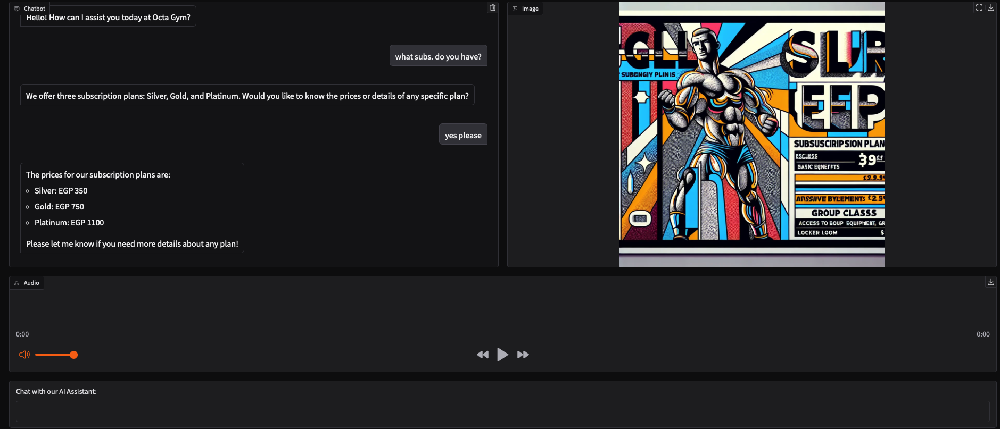

# 🧠 Octa Gym AI Assistant

An AI-powered customer support assistant for a gym in Cairo, Egypt.  
This project simulates a real-world AI agent that can interact with users, retrieve data, and respond using multiple modalities (text, image, and voice).

---

## 🚀 Features

- 💬 Natural conversation with users
- 🧠 AI agent with tool-calling (function calling)
- 🗄️ Retrieves real subscription prices from SQLite database
- 🔊 Converts responses to voice (Text-to-Speech)
- 🖼️ Displays images for subscription plans
- ⚡ Interactive UI built with Gradio

---

## 🧠 How It Works

1. User sends a message  
2. The AI decides whether it needs to use a tool  
3. If needed, it calls a function (e.g. get subscription price)  
4. The system queries the database  
5. The AI responds with:
   - Text answer  
   - Image (optional)  
   - Voice output  

---

## 🛠️ Tech Stack

- Python
- OpenAI API (LLM + TTS)
- SQLite
- Gradio

---

## 📸 Demo



---

## ▶️ Run Locally

```bash
git clone https://github.com/marco06013/octa-gym-ai-agent.git
cd octa-gym-ai-agent
pip install -r requirements.txt
python app.py